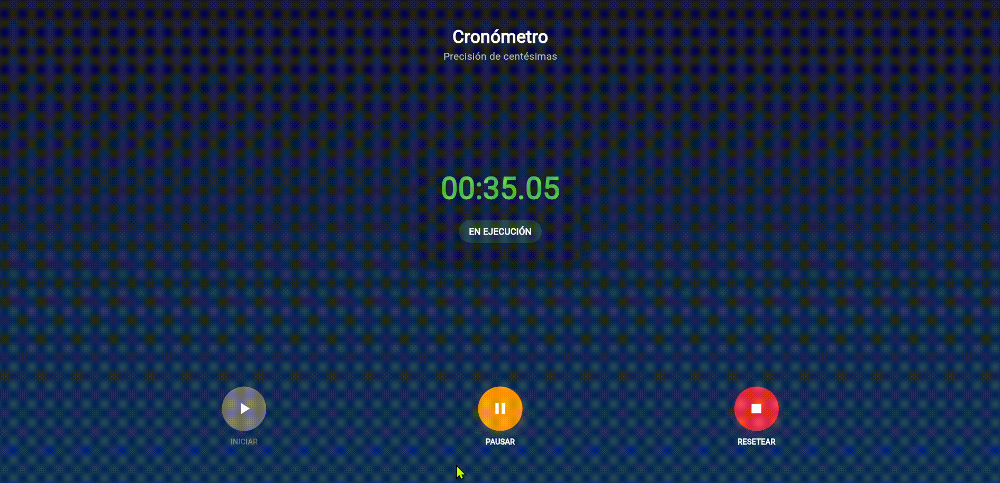
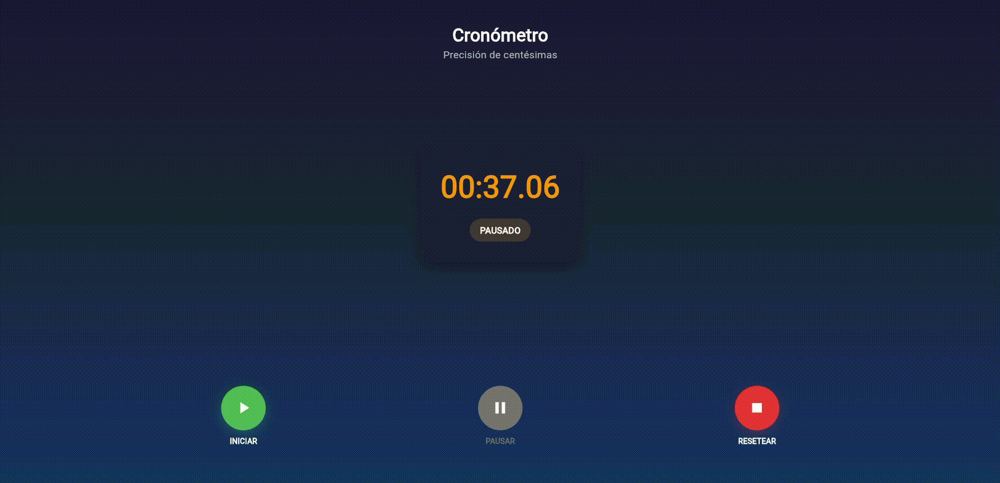
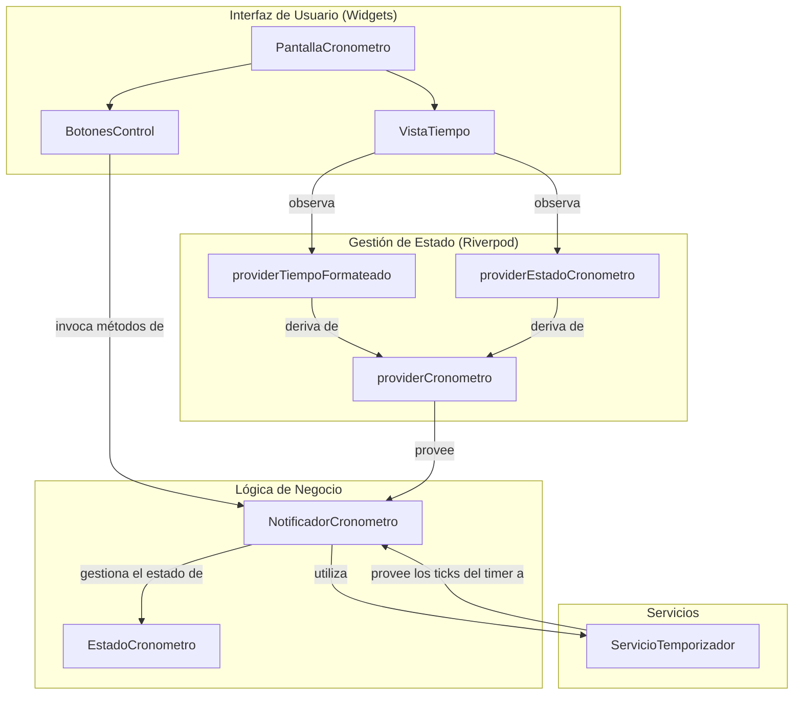

# 🕐 App Cronómetro


---


***Figura 1.** Iniciar conteo*


***Figura 2.** Pausar conteo*


***Figura 3.** Resetear conteo*

## 📱 Características

### ✨ Funcionalidades

  - **⏱️ Cronómetro de alta precisión** (centésimas de segundo)
  - **🎮 Control intuitivo** con botones de Iniciar, Pausar y Resetear
  - **📊 Estados visuales** diferenciados para cada modo de operación
  - **🔄 Hot Reload** para desarrollo rápido
  - **📱 Responsive Design** compatible con web, móvil y desktop

### 🎨 Interfaz de Usuario

  - **🌙 Tema oscuro moderno** con gradientes elegantes
  - **✨ Animaciones fluidas** y transiciones suaves
  - **🎯 Estados visuales claros**: Listo, En Ejecución, Pausado
  - **🔘 Botones inteligentes** que se habilitan/deshabilitan según el contexto
  - **💫 Efectos visuales** con sombras y profundidad

## 🏗️ Arquitectura

### 📂 Estructura del Proyecto

```
lib/
├── main.dart                    # Punto de entrada de la aplicación
├── models/                      # Modelos de datos inmutables
│   └── stopwatch_state.dart     # Estado del cronómetro
├── providers/                   # Lógica de negocio con Riverpod
│   └── stopwatch_provider.dart  # Provider principal y derivados
├── screens/                     # Pantallas de la aplicación
│   └── stopwatch_screen.dart    # Pantalla principal del cronómetro
├── widgets/                     # Componentes reutilizables
│   ├── time_display.dart        # Display del tiempo
│   └── control_buttons.dart     # Botones de control
├── services/                    # Servicios de negocio
│   └── timer_service.dart       # Servicio de temporizador
└── constants/                   # Constantes globales
    ├── app_colors.dart          # Paleta de colores
    └── app_text_styles.dart     # Estilos de texto
```

### 📊 Diagrama de Flujo de la Aplicación



## 🚀 Instalación y Configuración

### 📋 Prerrequisitos

  - **Flutter SDK** \>= 3.10.0
  - **Dart SDK** \>= 3.0.0
  - **Editor**: VS Code o Android Studio con extensiones de Flutter

### 🛠️ Configuración del Proyecto

1.  **Clonar el repositorio:**

    ```bash
    git clone https://github.com/jesusvasquezjr3/cronometro_app.git
    cd cronometro_app
    ```

2.  **Configurar dependencias** en `pubspec.yaml`:

    ```yaml
    dependencies:
      flutter:
        sdk: flutter
      flutter_riverpod: ^2.4.9
      cupertino_icons: ^1.0.2
    ```

3.  **Instalar dependencias:**

    ```bash
    flutter pub get
    ```

### 🎯 Ejecución

#### 🌐 En Navegador Web:

```bash
flutter run -d chrome
# o
flutter run -d edge
```

#### 📱 En Emulador/Dispositivo Móvil:

```bash
# Listar dispositivos disponibles
flutter devices

# Ejecutar en dispositivo específico
flutter run
```

#### 🖥️ En Desktop (Windows):

```bash
flutter config --enable-windows-desktop
flutter run -d windows
```

## 🎮 Uso de la Aplicación

### 🎯 Controles Principales

1.  **▶️ INICIAR**: Comienza el cronómetro desde cero o continúa desde una pausa
2.  **⏸️ PAUSAR**: Pausa el cronómetro manteniendo el tiempo actual
3.  **⏹️ RESETEAR**: Reinicia el cronómetro a 00:00.00

### 📊 Estados del Cronómetro

  - **🔵 LISTO**: Estado inicial, listo para comenzar
  - **🟢 EN EJECUCIÓN**: Cronómetro contando activamente
  - **🟠 PAUSADO**: Cronómetro pausado, puede reanudarse

### ⏱️ Precisión del Temporizador

  - **Frecuencia**: Actualización cada 10 milisegundos
  - **Resolución**: Muestra centésimas de segundo (00:00.00)
  - **Rendimiento**: Optimizado para 60+ FPS

### 📱 Compatibilidad

  - **✅ Web**: Chrome, Edge, Firefox, Safari
  - **✅ Android**: API 21+ (Android 5.0+)
  - **✅ iOS**: iOS 11.0+
  - **✅ Windows**: Windows 10+
  - **✅ macOS**: macOS 10.14+
  - **✅ Linux**: Ubuntu 18.04+

## 🎨 Personalización

### 🌈 Colores

Modifica `lib/constants/app_colors.dart` para cambiar la paleta:

```dart
class AppColors {
  static const Color backgroundColor = Color(0xFF1A1A2E);
  static const Color startButtonColor = Color(0xFF4CAF50);
  // ... más colores
}
```

### 🔤 Tipografía

Personaliza estilos en `lib/constants/app_text_styles.dart`:

```dart
class AppTextStyles {
  static const TextStyle timeDisplay = TextStyle(
    fontSize: 48,
    fontWeight: FontWeight.bold,
    // ... más propiedades
  );
}
```


